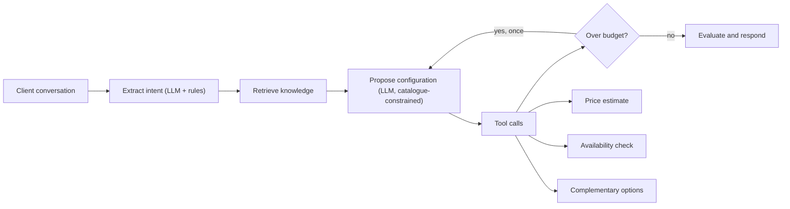

# Luxury Concierge Agent

Agentic AI concierge for bespoke luxury vehicle configuration. A client describes
the experience they want; the agent extracts structured intent, retrieves product
knowledge, proposes a configuration from a catalogue database, calls mocked
commercial tools for price and availability, re-negotiates when the estimate
breaks the client's budget, and returns a sales-ready summary.

## Setup

```powershell
uv sync --extra dev
```

Create a `.env` in the project root with a free Groq key from
<https://console.groq.com> → API Keys:

```env
GROQ_API_KEY=your-key-here
LCA_MODEL_PROVIDER=groq
LCA_LLM_BASE_URL=https://api.groq.com/openai/v1
LCA_LLM_MODEL=llama-3.3-70b-versatile
```

```powershell
uv run uvicorn app.server:app --reload --port 8000
```

Open <http://127.0.0.1:8000>.

`.env` is gitignored. Never paste a real API key into GitHub, chat, screenshots,
or the README.

The front end is hand-written HTML, CSS and JavaScript served by FastAPI - no
build step, no Node, no web fonts, so it renders identically offline. A
dashboard framework was the wrong instrument here: this is a client-facing tool
for a luxury marque, and framework chrome reads as a template.

A Streamlit version remains at `app/streamlit_app.py` for comparison:

```powershell
uv run streamlit run app/streamlit_app.py
```

### Any OpenAI-compatible provider

The integration is a base URL, a model id and a key, so switching provider is
configuration rather than code. The first key found among `LLM_API_KEY`,
`XAI_API_KEY`, `GROQ_API_KEY`, `GEMINI_API_KEY`, `OPENROUTER_API_KEY` and
`OPENAI_API_KEY` is used.

| Provider | `LCA_LLM_BASE_URL` |
| --- | --- |
| Groq | `https://api.groq.com/openai/v1` |
| Google Gemini | `https://generativelanguage.googleapis.com/v1beta/openai/` |
| OpenRouter | `https://openrouter.ai/api/v1` |
| xAI (Grok) | `https://api.x.ai/v1` |
| OpenAI | `https://api.openai.com/v1` |

### When the model is unreachable

The app still answers, from deterministic rules, and says so rather than
pretending. The sidebar shows a connection status, a running meter of calls,
failures and tokens, and the text of the last model error.

That visibility is deliberate. A tolerant fallback makes a broken key look
exactly like a working demo, so the failure has to be counted and displayed.

## Design: LLM proposes, schema disposes

The model contributes judgement and nothing else.

| Decision | Owner |
| --- | --- |
| Understanding the brief | LLM, validated into `ExtractedBrief` |
| Choosing the configuration | LLM, restricted to catalogue rows |
| Price, lead time, budget fit | Deterministic Python |
| Whether to re-configure | Conditional graph edge |
| Writing the summary | LLM, grounded in retrieved knowledge |

Every value the model returns must already exist in the catalogue database. A
configuration containing an invented finish is discarded whole - not patched -
and the rule-based proposal takes over. No path exists by which a language model
can influence a price, a lead time, or an availability status.

Each answer records whether the brief and the configuration came from the model
or the fallback rules, and the UI shows it.

### Budgets are enforced, not requested

On a re-configuration the model is given surcharges and a ceiling. It frequently
ignores the ceiling - it weighs the client's stated wishes above an instruction,
so a 95,000 gallery commission survives a 65,000 headroom. A budget is a hard
constraint, so Python enforces it afterwards: discretionary options are dropped
priciest-first, then materials fall back to house defaults.

Nothing is dropped silently. Whatever the budget removed is named in the summary,
because a client must not discover a downgrade at handover.

Where the model's base price alone exceeds the budget, no specification can fit.
The summary says so and names the model tier as the only route, rather than
shaving options against an impossible target.

## Architecture



## Catalogue database

`data/catalog.db` (SQLite, rebuilt automatically if absent) holds 4 models,
20 paints, 14 leathers, 10 veneers, 8 wheels, 57 priced options, per-region
availability with lead times, regional price uplifts, and configuration
constraints. Pricing is itemised from these rows.

All figures are illustrative sales-discovery data. Bespoke commission pricing is
not published by any manufacturer, so there is no public source for it.

## Conversation history

`data/conversations.db` (SQLite) keeps every commission conversation, its briefs,
and the full structured result of each answer.

It is a **separate file from the catalogue on purpose**. `catalog.db` is a build
artifact - `build_database` drops every table and reseeds it from `seed.py` and
`knowledge.py`, and it is gitignored because it regenerates on demand.
Conversations are the only data here that cannot be reconstructed, so they live
in a file that nothing rebuilds.

Each assistant turn stores the whole result payload, not just its prose, so
reopening a conversation re-renders the commission document - swatch, ledger,
provenance and all - rather than a transcript of text.

Memory is read from the database rather than posted by the browser. The client
sends only a `conversation_id`, so it cannot rewrite what the agent believes was
said earlier in the sale.

| Endpoint | Purpose |
| --- | --- |
| `POST /api/brief` | Configure; omit `conversation_id` to start a new one |
| `GET /api/conversations` | List, newest first |
| `GET /api/conversations/{id}` | Full transcript with stored payloads |
| `DELETE /api/conversations/{id}` | Remove a conversation and its turns |

## Retrieval

Knowledge lives in the same database as the catalogue, in a `knowledge` table of
48 focused passages covering positioning, materials, paint, availability,
regional considerations, wheels, options, sustainability, the commission
process, personalisation, client archetypes, pricing guidance and aftercare.
There is no second knowledge source.

One row is one passage, and one passage is one embedding. That is deliberate:
whole-document embeddings average several topics into a single vector and
retrieve poorly, so the unit of storage is the unit retrieval should return.

Two backends over the same rows. `lexical` is TF-IDF over the prose plus a
curated keyword column, and needs no setup. `chroma` is semantic and runs an
on-device ONNX embedding model, so it needs no API key either - which matters
because most chat-only providers, Groq and xAI included, expose no embeddings
endpoint at all.

```powershell
uv run lca-ingest
$env:LCA_RETRIEVER_BACKEND="chroma"
uv run streamlit run app/streamlit_app.py
```

Both backends resolve "parked outdoors under blazing sunshine in a gritty, arid
place" to the regional heat-and-sand guidance. Semantic retrieval earns its
place on vocabulary the curated keywords do not anticipate; lexical retrieval is
faster, needs no model, and is the default.

## Stack

- Python 3.11+
- LangGraph agent with a conditional re-configuration loop
- SQLite catalogue and knowledge base, single source of truth
- ChromaDB vector store with local ONNX embeddings, no API key
- Groq (or any OpenAI-compatible provider) for reasoning and wording
- Pydantic schemas constraining every model output
- Streamlit UI with an agent trace, provenance labels and a usage meter
- Typer eval CLI, pytest, ruff, pyright

## Evaluation

```powershell
uv run lca-eval          # offline, ~1.5s, no tokens spent
uv run lca-eval --live   # exercises the model path deliberately
uv run pytest -q
```

The suite is **offline by default**. These cases assert the deterministic layer,
so calling a hosted model spends a daily token quota on a result they never
check, and makes a suite that should be repeatable depend on a rate limit. One
`--live` run costs roughly 40,000 tokens; the free tier is 100,000 a day.

20 scenario cases plus unit tests. The evals assert against the agent's
structured state - chosen model, region, materials, budget verdict, retrieval
categories, proposal count - rather than substrings in the prose. That matters:
the summary echoes the client's brief, so a text assertion can pass on words the
client supplied rather than on anything the agent decided.

They run without a model key, exercising the deterministic layer that must never
regress. Cases include the over-budget re-configuration loop, the vegan-cabin
constraint, and a check that every priced line resolves to a real catalogue row.

## Current limitations

- Commercial data is illustrative; the tool interfaces stand in for real dealer
  systems, and bespoke commission pricing is not published by any manufacturer.
- Budgets are treated as EUR regardless of the currency the client states.
- Option shortlisting before the configuration call keeps the prompt small; that
  narrowing is keyword-based, so an unusual brief may not surface every relevant
  option.
- Retrieval feeds the configuration prompt but is not yet cited line by line in
  the summary, so a reader cannot trace an individual claim to a passage.
