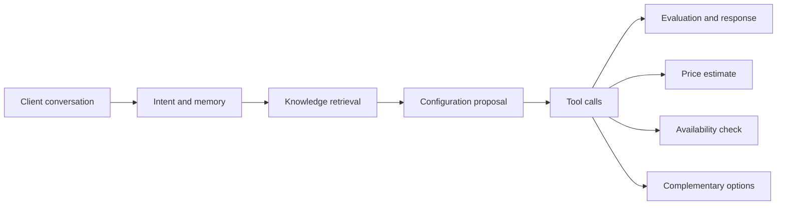

# Luxury Concierge Agent

Agentic AI concierge for bespoke luxury vehicle configuration. A client describes
their desired experience; the agent retrieves product knowledge, proposes a
configuration, calls mocked commercial tools, and returns a sales-ready summary.

## Demo

```powershell
uv sync --extra dev
Copy-Item .env.example .env
uv run streamlit run app/streamlit_app.py
```

Mock mode works without an API key. Use it first to verify the project.

## No-Credit Local LLM Option

You can run the project without buying OpenAI API credits.

The default portfolio-safe path is:

```env
LCA_MODEL_PROVIDER=mock
LCA_RETRIEVER_BACKEND=lexical
```

For a real local LLM, install Ollama, pull a model, and switch the provider:

```powershell
ollama pull llama3.1:8b
```

```env
LCA_MODEL_PROVIDER=ollama
LCA_OLLAMA_BASE_URL=http://localhost:11434
LCA_OLLAMA_MODEL=llama3.1:8b
LCA_OLLAMA_TIMEOUT_SECONDS=90
LCA_RETRIEVER_BACKEND=lexical
```

This uses the local model only for sales-summary wording. The deterministic
tools and LangGraph flow still control the business logic.

To use semantic RAG with OpenAI embeddings:

```powershell
$env:OPENAI_API_KEY="sk-proj-your-key-here"
$env:LCA_RETRIEVER_BACKEND="chroma"
python -m lca.rag.ingest
streamlit run app/streamlit_app.py
```

## Architecture



## Stack

- Python 3.11+
- LangGraph-ready agent structure
- Local markdown knowledge base
- ChromaDB local vector store with OpenAI `text-embedding-3-small`
- Streamlit UI
- Typer eval CLI
- `uv` dependency management

## API Key Setup

Create an OpenAI API key from the OpenAI Platform dashboard, then copy
`.env.example` to `.env` and set:

```env
LCA_MODEL_PROVIDER=openai
OPENAI_API_KEY=sk-proj-your-key-here
LCA_OPENAI_MODEL=gpt-4o-mini
```

Never paste a real API key into GitHub, chat, screenshots, or the README.

## Evaluation

```powershell
uv run lca-eval
```

Current starter harness includes 5 behavior checks. The portfolio target is
15-20 cases covering model fit, regional constraints, budget/timeline handling,
and sales-summary quality.

## Current Limitations

- Commercial data is mocked.
- Retriever defaults to lexical search so the app can run before API setup.
- The first pass uses deterministic response synthesis; real model-written sales
  summaries are the next implementation step after the API key is configured.
